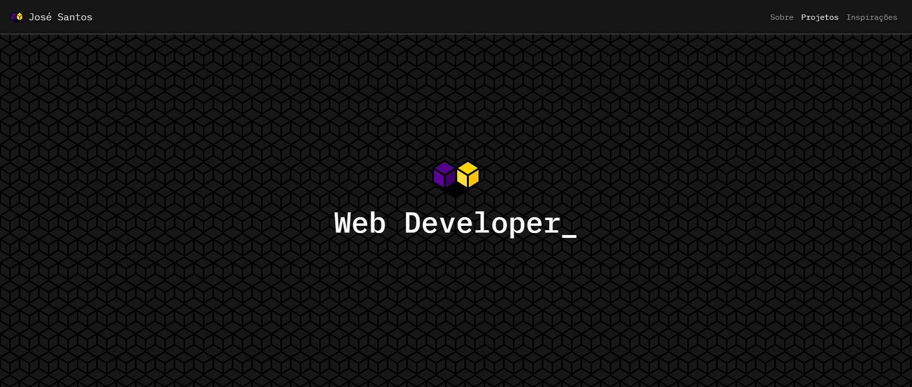

# Portfólio Pessoal José

## 🌐 Acesso ao site

O acesso à aplicação já está disponível [aqui](https://portfolio-josematheussk.vercel.app/), ou no seguinte link: https://portfolio-josematheussk.vercel.app/

## 💻 Projeto

Esta aplicação web é um portfólio pessoal onde me apresento, falo brevemente sobre mim, mostro meus principais projetos e deixo meios de comunicação comigo.

## 🧪 Tecnologias

Esse projeto foi desenvolvido com as seguintes tecnologias:

- [ReactJS](https://reactjs.org)
- [TypeScript](https://www.typescriptlang.org/)
- [BootStrap](https://getbootstrap.com/)
- JavaScipt
- CSS3

